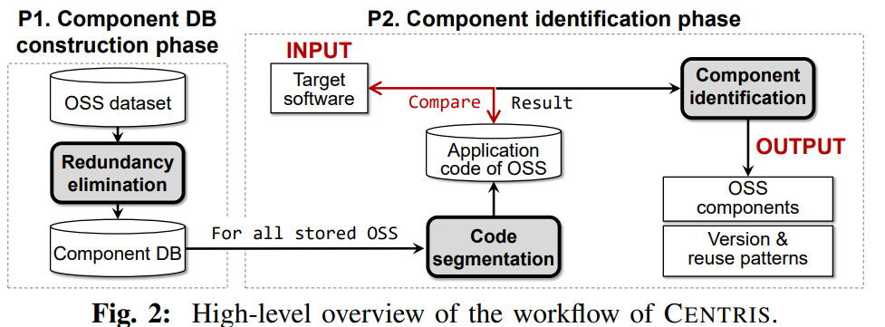

# Centris

- 논문 리뷰 전 [IoT 컨퍼런스2025 pdf](https://cssa.korea.ac.kr/_res/cssa/etc/IoTcube_Conference_20251001_v1.pdf)
    - **SBOM (Software Bill of Materials, 소프트웨어 자재명세서)**
        - 제품에 포함된 모든 소프트웨어 구성요소(패키지·버전·공급자 등)를 목록화한 문서로, 각 구성요소 출처·의존관계를 가시화해 취약점 추적·패치·위험평가를 가능케 함 (SPDX, CycloneDX 형식 활용)
    - **VEX (Vulnerability Exploitability eXchange, 취약점 상태 기술 표준 문서)**
        - SBOM으로 확인된 취약점이 실제 제품에서 악용 가능한지 여부(affected/not affected/fixed 등)를 기계판독 가능한 형식으로 제공하는 문서로, 수백 건의 알려진 취약점 중 실제 대응 필요한 항목만 선별하도록 지원
    - **개발 전 과정에서의 보안 전략**
        1. **보안 내재화(Secure SDLC)**
        개발 초기부터 보안 검증 포함해 설계 단계에서 취약점 예방
        IoTcube 플랫폼의 Vuddy(대규모 취약 코드 패턴 탐지, IEEE
        S&P '17), Cneps(오픈소스 의존성 분석, ICSE '24) 기술로
        코드 단계부터 취약점 사전 탐지
        2. **구성요소 가시화(SBOM)**
        제품 포함된 SW 구성요소(공급자 등)를 투명하게 목록화
        소스코드·바이너리를 분석해 SBOM 및 VEX를 자동 생성하는
        IoTcube 2.0(Hatbom) 도구 활용 제안
        SBOM 기반 오픈소스 라이선스·취약점·EOL 상태 사전 점검
        3. **운영 단계 취약점 검증(VEX)**
        SBOM으로 파악된 취약점 중 악용 가능한 항목 위주 관리
        분석 결과를 VEX 문서 자동 생성·배포하는 파이프라인 연구
        진행 중
    - **HatBOM 프로세스**
        1. **SBOM 생성**
            - 사용자는 소스코드 또는 해시 암호화된 파일 업로드
            (차후 바이너리·컨테이너·URL 등 지원 예정)
            - 복잡한 설정 없이 플랫폼이 자동으로 소프트웨어 자재명세서(SBOM)를 생성
            - 제품에 포함된 구성요소의 패키지·버전·공급자·의존관계까지 투명하게 가시화
        2. 취약점 분석
            - 단순 나열이 아닌, 실제 악용 가능성이 높은 취약점에 집중
            - 전체 중 약 5%의 고위험 취약점 코드 존재 여부와 도달 가능성(reachability) 평
            - 기업이 위험도 기반 우선순위 설정 및 대응 전략 수립 가능
        3. VEX 문서화
            - 분석 결과를 VEX(Vulnerability Exploitability eXchange) 형식으로 변환
            - 각 취약점의 실제 위험 여부(affected / not affected)와 데이터 흐름·보안 상태 변화를 시각적 대시보드로 제공
            - 기업이 보안 리스크를 직관적으로 파악하고 대응 전략 수립 가능

- OSS 재사용 패턴
    - Exact reuse(E)
    - Partial reuse(P)
    - Sturcture-changed reuse(SC)
    - Code-chaged reuse(CC)

- CENTRIS
    - 중복 제거 기법 사용
    - 전체 OSS 코드 베이스의 모든 버전에 포함된 모든 함수에 시그니처를 생성하지 않고,
    하나의 OSS 프로젝트의 모든 버전에 포함된 모든 함수를 수집, 버전들 사이의 함수 중복을제거
    - 정밀성을 위해 코드 분할 기법 사용
    → 수정된 컴포넌트를 식별하기 위해 기본적으로 대상 소프트웨어와 OSS 사이의 코드 유사도가 사전에 정의된 임계값보다 큰지를 확인하는 느슨한 매칭을 사용
        - 위 방법 단순 사용시 오탐 확률이 증가함
        - OSS의 고유한 부분과 차용 코드를 분할함
        → 차용 코드 제거 후 컴포넌트 식별을 위해 에플리케이션 코드 재사용 피턴만 분석함
        ⇒ 심하게 수정되거나 중첩된 경우도 원하는 컴포넌트 포착 가능
    - 탐지 과정
        
        
        
        1. 컴포넌트 DB 구축 단계(P1)
            - 중복 제거: diff를 통해 버전별 특징을 추출 → 데이터 압축
            - OSS 시그니처 추출
                1. OSS 모든 버전에 있는 모든 함수 추출
                2. OSS의 전체 버전 수와 같은 수의 BIN 생성
                3. 특정 함수가 서로 다른 i 개의 버전에 나타날 시,
                해당 함수는 i 번째 bin에 버전 정보와 경로에 함께 저장됨
        2. 컴포넌트 식별(P2)
            - 대상 소프트웨어 안에서 재사용된 OSS 컴포넌트 식별
            - **공통함수**: 두 SW 프로젝트 사이 공통 함수 개념 정의
                - 각 LSH 알고리즘은 고유한 비교 방법과 절단값 제공
                - 프로젝트 사이의 각 함수 쌍에 대한 거리 측정정
            - LSH 기반의 느슨한 매칭은 오탐을 발생시킴
                - **프라임 OSS**: 제3자 SW를 포함시키지 않는 OSS
                → 프라임 OSS와 대상 product 간 다수의 공통 함수가 존재시, 올바른 컴포넌트로 간주될 수 있음 ⇒ 이는 탐지 조건을 위반하기 때문
                - **코드분할**: 컴포넌트 식별에서 OSS 코드만 고려시, 제3자 SW로 인한 거짓 경보는 발생하지 않음
            - 따라서 식별 과정을 다음 세개로 분할
                1. 컴포넌트 DB에 프라임 OSS 탐지
                2. 모든 OSS에서 애플리케이션 코드 추출
                3. 대상 소프트웨어 내의 컴포넌트 식별
                
                → 대상 소프트웨어의 모든 함수를 추출한 뒤, 추출된 함수에 텍스트 전처리와 LSH 알고리즘을 적용한 후 수행 됨
                
            1. 컴포넌트 DB에 프라임 OSS 탐지
                - S를 제3자 소프트웨어를 포함하는지 확인할 OSS라고 가정
                - S가 프라임 OSS인지 판단하기 위해, 먼저 S와  DB 안의 각  컴포넌트OSS(X라고 표시) 사이의 공통 함수를 탐지한다.
                - S와 하나 이상의 공통 함수를 갖는 OSS 프로젝트가 존재한다면, 
                S와 X의 관계는 네 가지 범주 중 하나에 속하는 것으로 결정될 수 있음
                    
                    
                    | 유형 | 설명 |
                    | --- | --- |
                    | R1 | S와 X가 널리 사용되는 코드를 공유한다. 예: 해시 함수 |
                    | R2 | S와 X가 동시에 다른 OSS 프로젝트를 재사용한다. |
                    | R3 | S가 X를 재사용한다. |
                    | R4 | X가 S를 재사용한다. |
                - 이 중 R2, R3는 S가 적어도 하나의 제3자 SW를 포함 하는것을 의미
                R1, R4 관계일 시, S가 프라임 OSS라고 볼 수 있음
                ⇒ 주요 과제는 R4를 R2와 R3로 구분하는게 메인 challenge임
                - 이를 위해 S와 X 사이의 공통 함수가 각 OSS에서 처음 등장한 시점에 주목
                → 탄생 시점이라  명명
                - X가 S를 재사용한다고 가정(R4)
                    - 이때 특정 재사용 함수 f의 탄생시점은 X에서보다 S에서 더 빠름
                    - S와 X 사이의 유사도 점수 $\phi$계산, $birth(f,S)$는 S에서 f의 탄생시점
                    $\phi(S,X) = \frac{|G|}{|X|}\\
                    G=\{f∣f∈(S∩X)∧birth(f,X)≤birth(f,S)\}$
                        - OSS 시그니처의 bin 안에 함수 해시값과 버전 정보가 있음
                        → 릴리스 날짜를 통해 계산
                    - 임계값 **$\theta$를 통해 R2와 R3를 구분지음**: $\phi(S,X) ≥ \theta$
                        
                        $S=\begin{cases}\text{Prime OSS}&\text{if ∀X. ϕ(S,X)<θ} \\
                        Non-prime OSS&\text{if ∃X. ϕ(S,X)≥θ}
                        \end{cases}$
                        
            2. **애플리케이션 코드 추출**
                - 컴포넌트 DB 안 모든 OSS에 대해 코드 분할을 통해 애플리케이션 코드 추출
                - 프라임 OSS는 차용 코드를 갖지 않으므로
                비프라임 OSS 프로젝트에만 초점을 맞춤
                - S를 OSS의 관심대상으로 둠(ex. 시그니처)
                - S의 애플리케이션 코드 $S_A$를 찾는 한가지 방법은 $S$에서 차용코드 $S_B$를 제거하는것임: $S_A=S\setminus S_B$
                    - 그러나 이는 $S_B$에 속하는 OSS를 탐지하는 역설을 낳음
                    → OSS 컴포넌트를 식별하기 위한 CENTRIS 방법론이, OSS의 컴포넌트를 식별하기 위해 동일한 방법론을 필요로 하기 때문
                - S의 하위 컴포넌트를 정확히 식별할 필요가 없음
                대신 이전 단계예서 얻은 S의 가능한 구성원(P)를 사용함
                    
                    
                    
                    - P는 S의 가능한 구성원이므로 S 내에서 재사용 되거나(R2),
                    S와 공통의 제 삼자 SW를 사용할 것임(R3)
                    ⇒ P는 S의 애플리케이션 코드에 속할 수 있는 코드를 가지고 있지 X
                    - 따라서 S의 함수 집합에서 가능한 구성원들의 모든 함수를 제거하면
                    S의 애플리케이션 코드를 얻을 수 있음
                
                ⇒ 컴포넌트 DB 안의 모든 OSS 프로젝트는 
                     (i) 프라임으로 탐지되었거나, 
                     (ii) 비프라임 OSS 프로젝트의 경우 애플리케이션 코드가 추출된 상태로 남음
                
        3. **컴포넌트 식별**
            - 대상 SW의 OSS 컴포넌트 식별
            - T를 대상 SW, S를 컴포넌트 DB 안의 OSS라고 정의
            - S가 T의 컴포넌트인지 식별하기 위해 T와 S의 애플리케이션 코드 사이의 유사도 점수 측정함
                
                $Φ(T,S)=\frac{|T∩S_A|}{|S_A|}$
                
            - T와  S 모두 일반적으로 사용되는 코드 존재 가능(R1)
            →  임계값 $\theta$를 필터로 사용 $Φ(T,S)≥\theta$
            - 이를 통해 대상 SW의 OSS 컴포넌트 집합을 얻을 수 있음
    - Centris가 정확한 이유
        - 식별 단계에서 구조 정보를 사용하지 않기 때문에 
        구조 변경 여부와 관계없이 컴포넌트를 식별 가능함
        - OSS가 중첩되어 있는지와 관계없이, 각 OSS의 애플리케이션 코드가 θ보다 큰 비율로 재사용될시 해당 OSS는 올바른 컴포넌트로 식별
        - CENTRIS의 코드 분할은 거짓 양성을 줄일 뿐만 아니라, 심하게 수정된 컴포넌트를 식별하는 데도 도움이 됨
    - **버전 식별**
        - 각 컴포넌트의 재사용된 버전을 식별하기 위해, 우리는 OSS 컴포넌트의 재사용된 함수들에 초점을 맞춤
        - 각 재사용 함수에 가중치를 부여, 더 적은 수의 버전에 속하는 함수에 더 큰 가중치 부여
            - TF-IDF 사용
            - $W(f)=log(n/|V(f)
            |)$
        - $i$번째 bin에 속하는 함수 $f$의 $|V(f)|$값은 $i$이다
        → OSS 컴포넌트의 모든 재사용 함수들 순회하면서 각 함수의 가중치를 해당 함수가 속한 버전들의 점수에 가산함
        ⇒ 가장 높은 점수를 가진 버전을 사용된 버전으로 식별함
    - **재사용 패턴 분석**
        - 탐지된 컴포넌트의 재사용 패턴을 분석
        - 재사용 중 발생한 코드 변경 식별을위해 LSH 알고리즘을 사용하여 각 함수 쌍의 거리 측정: $0 < distance ≤ \text{cutoff}$를 판단
        - 구조 변경을 측정하기 위해 변경함수와 원 함수간의 경로 차이를 분석
        → 각 함수 경로를 “/”로 분리, 각 경로를 뒤에서부터 순회하며 경로 수준을 비교분석함
        - 만약 모든 함수가 아무런 수정 없이 재사용될 시 이를 정확한 재사용으로 명명
- 구현
    - OSS 수집기, 전처리기, 컴포넌트 탐지기로 구성됨